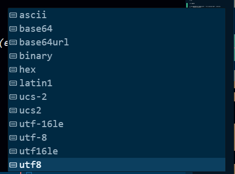

# Assignment

## The above image shows the character encodings available in Node.js when using `fs.readFile()` or `fs.writeFile()`. These encodings define how text is represented in bytes. When we read from or write to a file, Node.js needs to know which encoding to use to correctly interpret (decode) or store (encode) the text data.

## The below table shows what each selection do and it use cases:

| Encoding    | Description                                                    | Use Case                                                           |
| ----------- | -------------------------------------------------------------- | ------------------------------------------------------------------ |
| `ascii`     | 7-bit ASCII encoding (only basic English characters)           | Old systems, legacy English-only data                              |
| `base64`    | Encodes binary data to Base64 (text representation of binary)  | Sending images, files over network as text (e.g., in JSON or HTML) |
| `base64url` | URL-safe variant of base64                                     | Transmitting binary data in URLs, JWT tokens                       |
| `binary`    | Legacy alias for `latin1`, treats each byte as a character     | Mostly deprecated, avoid using                                     |
| `hex`       | Encodes each byte as two hexadecimal characters                | Hashes, debugging binary data                                      |
| `latin1`    | ISO-8859-1 encoding (Western European)                         | Reading legacy files written in Latin-1                            |
| `ucs-2`     | 2-byte fixed-width Unicode encoding (alias for `utf16le`)      | Unicode compatibility with legacy systems                          |
| `ucs2`      | Same as `ucs-2`, just different spelling                       | Same as above                                                      |
| `utf-16le`  | UTF-16 Little Endian encoding                                  | Used in Windows text files, some APIs                              |
| `utf-8`     | Multibyte Unicode encoding, supports all characters and emojis | ✅ Most common for modern text files and web data                   |
| `utf8`      | Same as `utf-8`                                                | ✅ Preferred default in Node.js                                     |
| `utf16le`   | Alias for `utf-16le`                                           | Same as above                                                      |
